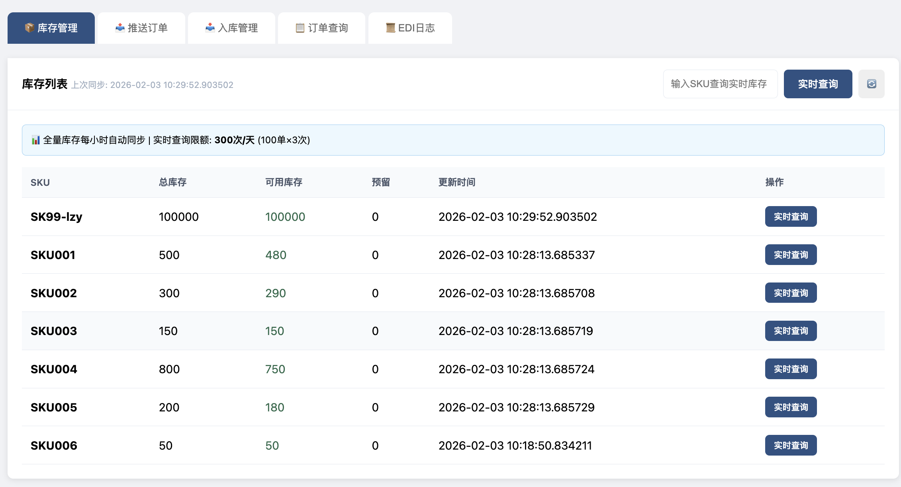
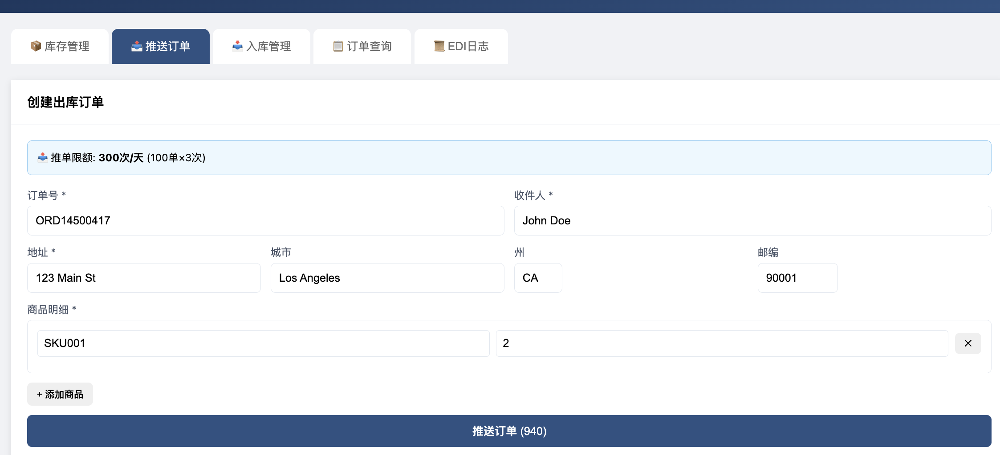
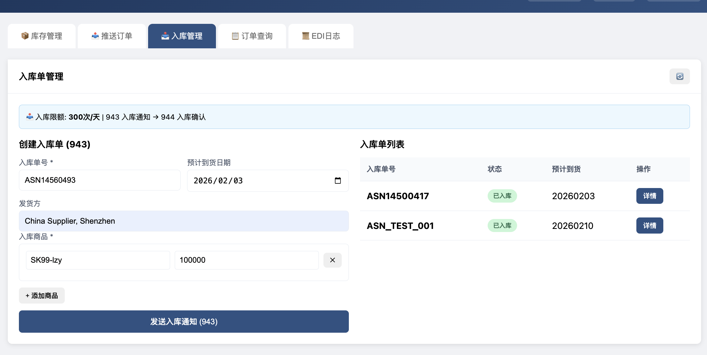
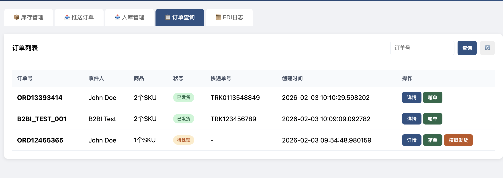
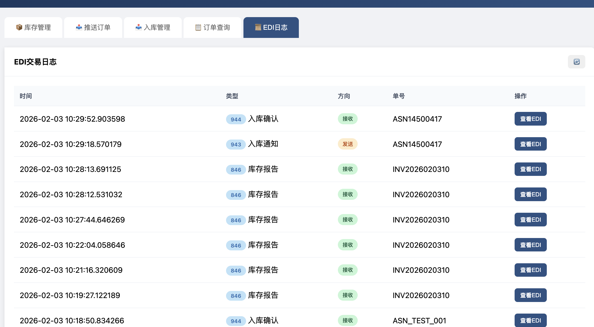
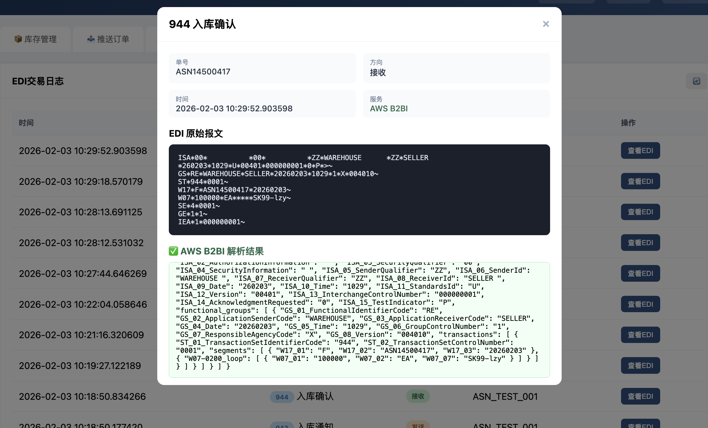

# 海外仓 EDI 业务系统

## 项目概述

本项目是一个**跨境电商卖家与海外仓对接的 EDI 业务系统**，集成 AWS B2B Data Interchange (B2BI) 服务实现 EDI 报文的标准化解析。

## 系统截图

### 库存管理


### 推送订单


### 入库管理


### 订单查询


### EDI 日志


### EDI 详情 (B2BI 解析结果)


---

## 业务背景

```
┌─────────────┐                    ┌─────────────┐
│  跨境电商    │      EDI 报文      │   海外仓    │
│    卖家     │ ◄────────────────► │   (3PL)    │
└─────────────┘                    └─────────────┘
      │                                   │
      │  940 出库指令 ──────────────────► │
      │  943 入库通知 ──────────────────► │
      │ ◄────────────────── 944 入库确认  │
      │ ◄────────────────── 945 出库确认  │
      │ ◄────────────────── 846 库存报告  │
```

### 核心功能

| 功能 | EDI 类型 | 方向 | 说明 |
|------|----------|------|------|
| 推送出库订单 | 940 | 卖家→仓库 | 通知仓库发货 |
| 发送入库通知 | 943 | 卖家→仓库 | 通知仓库即将到货 |
| 接收入库确认 | 944 | 仓库→卖家 | 确认货物已入库 |
| 接收出库确认 | 945 | 仓库→卖家 | 确认已发货，含快递单号 |
| 接收库存报告 | 846 | 仓库→卖家 | 同步库存数量 |

---

## 系统架构

```
┌────────────────────────────────────────────────────────────────────┐
│                         海外仓 EDI 业务系统                          │
├────────────────────────────────────────────────────────────────────┤
│                                                                    │
│   ┌──────────┐    ┌──────────────┐    ┌─────────────────────────┐ │
│   │  Web UI  │───►│  Flask App   │───►│  Warehouse Service      │ │
│   │ (浏览器)  │    │  (app.py)    │    │  (warehouse_service.py) │ │
│   └──────────┘    └──────────────┘    └───────────┬─────────────┘ │
│                                                   │               │
│                          ┌────────────────────────┼───────────┐   │
│                          │                        ▼           │   │
│   ┌──────────────┐   ┌───┴────────┐    ┌─────────────────────┐│   │
│   │ EDI Generator│◄──│ B2BI       │◄──►│      Amazon S3      ││   │
│   │ (本地生成)    │   │ Service    │    │  (EDI 文件存储)      ││   │
│   └──────────────┘   └───┬────────┘    └─────────────────────┘│   │
│                          │         AWS Cloud                  │   │
│                          ▼                                    │   │
│                   ┌─────────────────────────────────────────┐ │   │
│                   │         AWS B2B Data Interchange        │ │   │
│                   │  ┌─────────────────────────────────┐    │ │   │
│                   │  │  Transformers (EDI → JSON)      │    │ │   │
│                   │  │  • X12-940-to-JSON              │    │ │   │
│                   │  │  • X12-943-to-JSON              │    │ │   │
│                   │  │  • X12-944-to-JSON              │    │ │   │
│                   │  │  • X12-945-to-JSON              │    │ │   │
│                   │  │  • X12-846-to-JSON (内置)        │    │ │   │
│                   │  └─────────────────────────────────┘    │ │   │
│                   └─────────────────────────────────────────┘ │   │
│                                                               │   │
│   ┌──────────────────────────────────────────────────────────┐│   │
│   │                    SQLite Database                       ││   │
│   │  • inventory (库存)    • orders (订单)                    ││   │
│   │  • inbound_orders     • edi_logs (EDI日志)               ││   │
│   └──────────────────────────────────────────────────────────┘│   │
│                                                                │   │
└────────────────────────────────────────────────────────────────────┘
```

---

## AWS B2BI 集成流程

### B2BI 调用原理

```
┌─────────────────────────────────────────────────────────────────────┐
│                    B2BI test-parsing API 调用流程                    │
└─────────────────────────────────────────────────────────────────────┘

  应用代码                      Amazon S3                    AWS B2BI
     │                            │                            │
     │  ① PUT EDI 内容到 S3       │                            │
     │ ──────────────────────────►│                            │
     │    s3.put_object(          │                            │
     │      Bucket, Key, Body     │                            │
     │    )                       │                            │
     │                            │                            │
     │  ② 调用 test-parsing API   │                            │
     │ ───────────────────────────────────────────────────────►│
     │    b2bi.test_parsing(      │                            │
     │      ediType: X12_940,     │                            │
     │      inputFile: {          │  ③ B2BI 从 S3 读取 EDI     │
     │        bucketName,         │ ◄──────────────────────────│
     │        key                 │                            │
     │      }                     │                            │
     │    )                       │  ④ 解析 EDI 为 JSON        │
     │                            │                            │
     │  ⑤ 返回 parsedFileContent  │                            │
     │ ◄───────────────────────────────────────────────────────│
     │    {                       │                            │
     │      "interchanges": [...] │                            │
     │    }                       │                            │
```

### 代码实现 (b2bi_service.py)

```python
def parse_edi_content_with_b2bi(edi_type: str, content: str) -> dict:
    # ① 上传 EDI 到 S3 临时文件
    tmp_key = f'tmp/test_{edi_type}.edi'
    s3.put_object(Bucket=BUCKET, Key=tmp_key, Body=content.encode())
    
    # ② 调用 B2BI 解析
    resp = b2bi.test_parsing(
        ediType={'x12Details': {'transactionSet': f'X12_{edi_type}', 'version': 'VERSION_4010'}},
        fileFormat='JSON',
        inputFile={'bucketName': BUCKET, 'key': tmp_key}
    )
    
    # ⑤ 返回解析结果
    return {'success': True, 'parsed': json.loads(resp['parsedFileContent'])}
```

---

## 业务场景流程图

### 场景1: 出库流程 (940 → 945)

```
┌──────────┐                  ┌──────────┐                  ┌──────────┐
│   卖家   │                  │   系统   │                  │  海外仓  │
└────┬─────┘                  └────┬─────┘                  └────┬─────┘
     │                             │                             │
     │  1. 创建出库订单            │                             │
     │ ───────────────────────────►│                             │
     │                             │                             │
     │                             │  2. 生成 940 EDI            │
     │                             │ ─────────────┐              │
     │                             │              │              │
     │                             │ ◄────────────┘              │
     │                             │                             │
     │                             │  3. B2BI 验证 940 格式      │
     │                             │ ─────────────┐              │
     │                             │   ┌─────────┴─────────┐    │
     │                             │   │ S3 → B2BI → JSON  │    │
     │                             │   └─────────┬─────────┘    │
     │                             │ ◄───────────┘              │
     │                             │                             │
     │                             │  4. 发送 940 到仓库         │
     │                             │ ───────────────────────────►│
     │                             │                             │
     │                             │         (仓库处理中...)      │
     │                             │                             │
     │                             │  5. 仓库返回 945 确认       │
     │                             │ ◄───────────────────────────│
     │                             │                             │
     │                             │  6. B2BI 解析 945          │
     │                             │ ─────────────┐              │
     │                             │   ┌─────────┴─────────┐    │
     │                             │   │ 提取: 快递单号     │    │
     │                             │   │       承运商       │    │
     │                             │   └─────────┬─────────┘    │
     │                             │ ◄───────────┘              │
     │                             │                             │
     │  7. 更新订单状态            │                             │
     │ ◄───────────────────────────│                             │
     │    状态: shipped            │                             │
     │    快递: TRK123456          │                             │
```

### 场景2: 入库流程 (943 → 944)

```
┌──────────┐                  ┌──────────┐                  ┌──────────┐
│   卖家   │                  │   系统   │                  │  海外仓  │
└────┬─────┘                  └────┬─────┘                  └────┬─────┘
     │                             │                             │
     │  1. 创建入库单 (ASN)        │                             │
     │ ───────────────────────────►│                             │
     │    SKU001 x 100             │                             │
     │    SKU002 x 50              │                             │
     │                             │                             │
     │                             │  2. 生成 943 EDI            │
     │                             │ ─────────────┐              │
     │                             │              │              │
     │                             │ ◄────────────┘              │
     │                             │                             │
     │                             │  3. B2BI 验证 943 格式      │
     │                             │ ─────────────┐              │
     │                             │   ┌─────────┴─────────┐    │
     │                             │   │ S3 → B2BI → JSON  │    │
     │                             │   └─────────┬─────────┘    │
     │                             │ ◄───────────┘              │
     │                             │                             │
     │                             │  4. 发送 943 到仓库         │
     │                             │ ───────────────────────────►│
     │                             │                             │
     │                             │      (货物到达，仓库收货)    │
     │                             │                             │
     │                             │  5. 仓库返回 944 确认       │
     │                             │ ◄───────────────────────────│
     │                             │                             │
     │                             │  6. B2BI 解析 944          │
     │                             │ ─────────────┐              │
     │                             │   ┌─────────┴─────────┐    │
     │                             │   │ 提取: 实收数量     │    │
     │                             │   │       入库日期     │    │
     │                             │   └─────────┬─────────┘    │
     │                             │ ◄───────────┘              │
     │                             │                             │
     │  7. 更新库存                │                             │
     │ ◄───────────────────────────│                             │
     │    SKU001: +100             │                             │
     │    SKU002: +50              │                             │
```

### 场景3: 库存同步 (846)

```
┌──────────┐                  ┌──────────┐                  ┌──────────┐
│   卖家   │                  │   系统   │                  │  海外仓  │
└────┬─────┘                  └────┬─────┘                  └────┬─────┘
     │                             │                             │
     │                             │  1. 定时任务触发 (每小时)    │
     │                             │ ─────────────┐              │
     │                             │              │              │
     │                             │ ◄────────────┘              │
     │                             │                             │
     │                             │  2. 请求库存报告            │
     │                             │ ───────────────────────────►│
     │                             │                             │
     │                             │  3. 仓库返回 846            │
     │                             │ ◄───────────────────────────│
     │                             │                             │
     │                             │  4. B2BI 解析 846          │
     │                             │ ─────────────┐              │
     │                             │   ┌─────────┴─────────┐    │
     │                             │   │ 提取:             │    │
     │                             │   │  SKU001: 500/480  │    │
     │                             │   │  SKU002: 300/290  │    │
     │                             │   └─────────┬─────────┘    │
     │                             │ ◄───────────┘              │
     │                             │                             │
     │  5. 库存数据已更新          │                             │
     │ ◄ ─ ─ ─ ─ ─ ─ ─ ─ ─ ─ ─ ─ ─│                             │
     │    (可在 Web 界面查看)       │                             │
```

---

## API 限流设计

```
┌─────────────────────────────────────────────────────────────┐
│                    每日 API 调用限额                         │
├─────────────────────────────────────────────────────────────┤
│                                                             │
│   ┌─────────────────┐  ┌─────────────────┐                 │
│   │  库存实时查询    │  │   推送出库订单   │                 │
│   │   300 次/天     │  │   300 次/天      │                 │
│   │  (100单×3次)    │  │  (100单×3次)     │                 │
│   └─────────────────┘  └─────────────────┘                 │
│                                                             │
│   ┌─────────────────┐  ┌─────────────────┐                 │
│   │   下载箱单       │  │   创建入库单     │                 │
│   │   300 次/天     │  │   300 次/天      │                 │
│   │  (100单×3次)    │  │  (100单×3次)     │                 │
│   └─────────────────┘  └─────────────────┘                 │
│                                                             │
│   ┌─────────────────┐                                      │
│   │  全量库存同步    │  ← 定时任务，每小时自动执行            │
│   │   24 次/天      │                                      │
│   └─────────────────┘                                      │
│                                                             │
└─────────────────────────────────────────────────────────────┘
```

---

## 项目文件结构

```
edi-demo/
├── app.py                 # Flask Web 应用主入口
├── warehouse_service.py   # 业务逻辑层
├── edi_simulator.py       # EDI 报文生成器
├── b2bi_service.py        # AWS B2BI 服务集成
├── warehouse.db           # SQLite 数据库
└── README.md              # 本文档
```

---

## 快速启动

```bash
cd ~/edi-demo
python3 app.py
```

访问: http://localhost:8080

---

## AWS 资源

| 资源类型 | 名称/ID | 用途 |
|---------|---------|------|
| S3 Bucket | edi-demo-{AccountId} | 存储 EDI 文件 |
| B2BI Transformer | X12-940-to-JSON | 解析出库指令 |
| B2BI Transformer | X12-943-to-JSON | 解析入库通知 |
| B2BI Transformer | X12-944-to-JSON | 解析入库确认 |
| B2BI Transformer | X12-945-to-JSON | 解析出库确认 |

---

## EDI X12 报文示例

### 940 出库指令
```
ISA*00*          *00*          *ZZ*SELLER         *ZZ*WAREHOUSE      *...
GS*OW*SELLER*WAREHOUSE*20260203*1020*1*X*004010~
ST*940*0001~
W05*N*ORD123456~                    ← 订单号
N1*ST*John Doe~                     ← 收件人
N3*123 Main St~                     ← 地址
N4*Los Angeles*CA*90001*US~         ← 城市/州/邮编
W01*2*EA*****SKU001~                ← 商品: SKU001 x 2
W01*1*EA*****SKU002~                ← 商品: SKU002 x 1
SE*8*0001~
GE*1*1~
IEA*1*000000001~
```

### 945 出库确认
```
ISA*00*          *00*          *ZZ*WAREHOUSE      *ZZ*SELLER         *...
GS*SW*WAREHOUSE*SELLER*20260203*1030*1*X*004010~
ST*945*0001~
W06*N*ORD123456**20260203*FEDEX*TRK789~  ← 订单号/日期/承运商/快递单号
W12*SKU001*2*EA~                          ← 实发商品
W12*SKU002*1*EA~
SE*5*0001~
GE*1*1~
IEA*1*000000001~
```

---

## B2BI 解析结果示例

输入 940 EDI 后，B2BI 返回的 JSON:

```json
{
  "interchanges": [{
    "ISA_06_SenderId": "SELLER",
    "ISA_08_ReceiverId": "WAREHOUSE",
    "functional_groups": [{
      "transactions": [{
        "ST_01_TransactionSetIdentifierCode": "940",
        "segments": [{
          "W05_02": "ORD123456"
        }, {
          "N1_02": "John Doe"
        }]
      }]
    }]
  }]
}
```

---

## 验证 B2BI 调用

由于 `test-parsing` 是数据平面 API，CloudTrail 默认不记录。验证方式：

1. **查看 S3 临时文件**
   ```bash
   aws s3 ls s3://edi-demo-{AccountId}/tmp/
   ```

2. **查看数据库 EDI 日志**
   ```sql
   SELECT edi_type, b2bi_parsed FROM edi_logs;
   ```

3. **Web 界面** - EDI日志详情页显示绿色 "AWS B2BI 解析结果"
